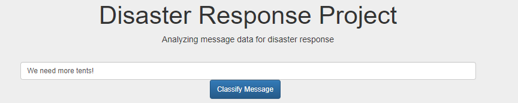
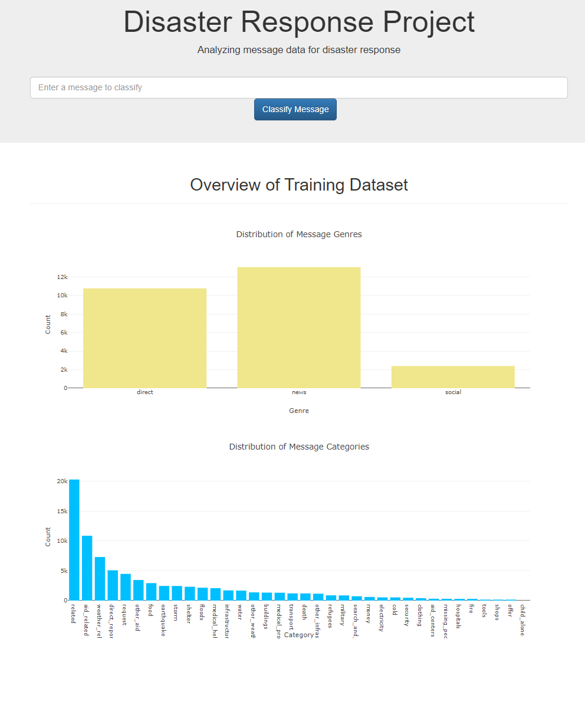
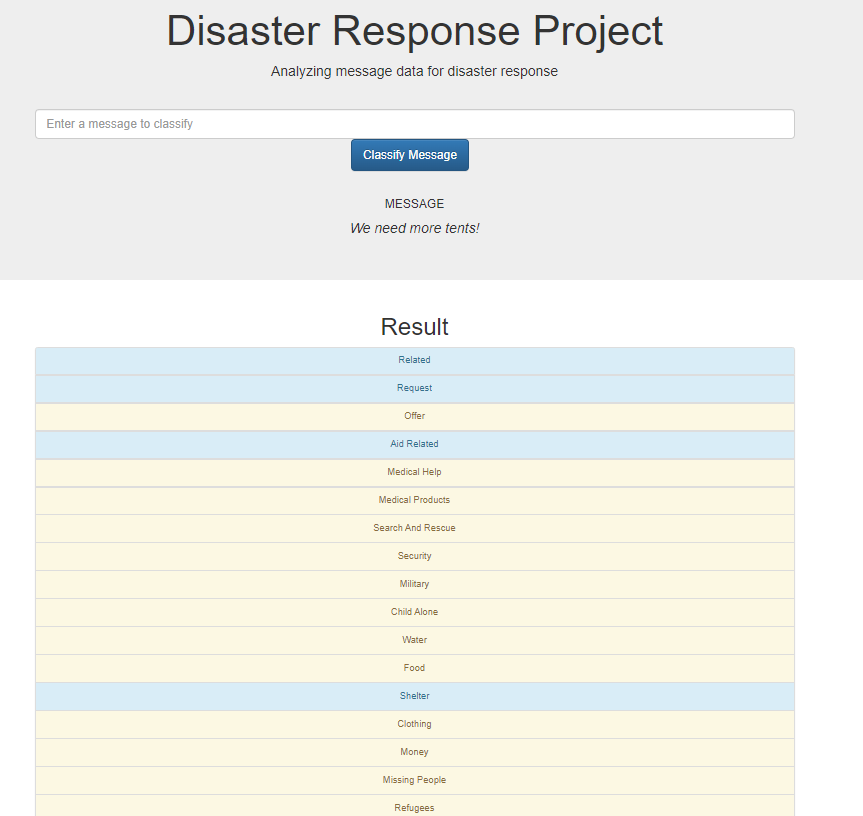

# Disaster Response Pipeline Project
### Data Science Nanodegree from Udacity




## Table of Contents
1. [Project Description](#description)
2. [Getting Started](#getting_started)
	1. [Dependencies](#dependencies)
	2. [Installation](#installation)
	3. [Execution](#execution)

3. [Authors](#authors)
4. [License](#license)
5. [Acknowledgement](#acknowledgement)
6. [Application](#Application)

<a name="descripton"></a>
## Description


This Project is part of Data Science Nanodegree Program by Udacity. The goal of the project is to build a Natural Language Processing model to categorize messages on a real time basis in a web application and display visualizations of the data.
The dataset presented in this project is from [Appen](https://appen.com/) (formally Figure 8) and contains of real messages that were sent during disaster events.

This project is divided in the following sections:

## File Description
~~~~~~~
        disaster_response_pipeline
          |-- app
                |-- templates
                        |-- master.html         # main page of the web app
                        |-- go.html             # classification result page of the web app
                |-- run.py
          |-- data
                |-- disaster_message.csv        # data to process
                |-- disaster_categories.csv     # data to process
                |-- DisasterResponse.db         # database contains clean data
                |-- process_data.py             # script for building an ETL pipeline and data cleaning
          |-- models
                |-- classifier.pkl              # saved model
                |-- train_classifier.py         # script for building a ML pipeline
          |-- notebooks
                |-- ETL Pipeline Preparation.ipynb
                |-- ETL_Preparation.db
          |-- README
~~~~~~~


<a name="getting_started"></a>
## Getting Started

<a name="dependencies"></a>
### Dependencies
* Python 3.8+
* Machine Learning Libraries: Pandas, Scikit-Learn
* Model Loading and Saving Library: Pickle, Joblib
* Natural Language Process Libraries: NLTK
* SQLlite Database Libraqries: SQLalchemy
* Web App and Data Visualization: Flask, Plotly

<a name="installation"></a>
### Installation
To clone the git repository:
```
git clone https://github.com/fuzhanrahmanian/Disaster_respond_pipeline_DSND.git
```
<a name="execution"></a>
### Execution:

For executing this work, following steps should be taken into account:

1. ETL pipeline is implemented in `process_data.py` for extracting, cleaning and processing the data. Eventually, the processed data is stored in a SQLite DB.
To run this pipeline, run the following command:
`python data/process_data.py data/disaster_messages.csv data/disaster_categories.csv data/DisasterResponse.db`

2. ML pipeline is implemented in `train_classifier.py` and is able to classify disaster text messages in different categories and the model will be eventually saved as a pickle file.
To run this pipeline, run the following command:
`python models/train_classifier.py data/DisasterResponse.db models/classifier.pkl`

3. In the last step, for visualizing the results, the implemented web app can be run by:
`python run.py`
Now, click/go to  http://0.0.0.0:3001/ and visualize the results.


<a name="authors"></a>
## Author

* [Fuzhan Rahmanian](https://github.com/fuzhanrahmanian)

<a name="license"></a>
## License
[](https://opensource.org/licenses/MIT)

<a name="acknowledgement"></a>
## Acknowledgements

* [Udacity](https://www.udacity.com/) for providing Data Science Nanodegree Program and this project.
* [Appen](https://appen.com/) for providing the disaster dataset.

<a name="Application"></a>
## Application

Below, the main page of the web app containing the overview of the training Dataset can be seen.


For finding your message classification, you are required to type your message and enter classify message button. The categories which the message belongs to, will be highlighted accordingly in blue. Below, you can see an example.
